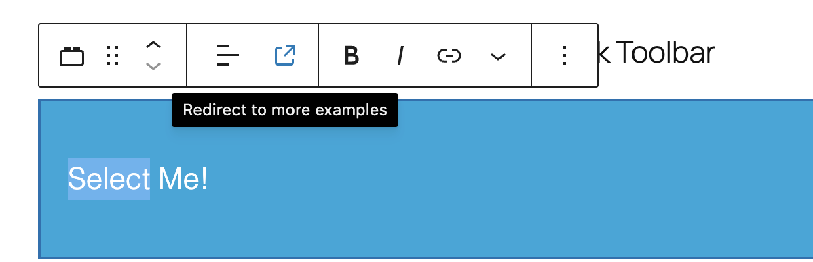

# Block Toolbar

The goal of this example is to show how to implement custom "Block Toolbar" controls for a block when selected

<!-- Please, do not remove these @TABLE EXAMPLES BEGIN and @TABLE EXAMPLES END comments or modify the table inside. This table is automatically generated from the data at _data/examples.json and _data/tags.json -->
<!-- @TABLE EXAMPLES BEGIN -->

| Example                                                                                                                   | Description                                   | Tags                                                                                                                               | Download .zip                                                                                                                                                                                                          | Live Demo                                                                                                                                                                                                                                                                                                                                        |
| ------------------------------------------------------------------------------------------------------------------------- | ----------------------------------------------------------------------------------------------------- | ---------------------------------------------------------------------------------------------------------------------------------- | ---------------------------------------------------------------------------------------------------------------------------------------------------------------------------------------------------------------------- | ------------------------------------------------------------------------------------------------------------------------------------------------------------------------------------------------------------------------------------------------------------------------------------------------------------------------------------------------ |
| [Block Toolbar Controls](https://github.com/juanma-wp/block-development-examples/tree/trunk/plugins/block-toolbar-ab967f) | Demonstrates how to add custom controls to the block toolbar for enhanced block editing capabilities. | <small><code><a href="https://juanma-wp.github.io/block-development-examples/?tags=block-toolbar">block-toolbar</a></code></small> | [📦](https://github.com/juanma-wp/block-development-examples/releases/download/latest/block-toolbar-ab967f.zip 'Install the plugin on any WordPress site using this zip and activate it to see the example in action') |  |

<!-- @TABLE EXAMPLES END -->

## Understanding the Example Code

Interesting things of this example are:

-   The use of `BlockControls` to wrap up the controls to display in the Block Toolbar when the block is selected
-   The import of custom icons from `@wordpress/icons` to use them in buttons
-   The use of standard UI elements from `@wordpress/components` (`ToolbarGroup` and `ToolbarButton`) to shape the Block Toolbar ;

## Related resources

-   [Storybook for WordPress components](https://wordpress.github.io/gutenberg/?path=/docs/docs-introduction--page)
-   [@wordpress/block-editor](https://developer.wordpress.org/block-editor/reference-guides/packages/packages-block-editor/)
-   [@wordpress/components](https://developer.wordpress.org/block-editor/reference-guides/packages/packages-components/)

---

> **Note**
> Check the [Start Guide for local development with the examples](https://github.com/juanma-wp/block-development-examples/wiki/Examples#start-guide-for-local-development-with-the-examples)
